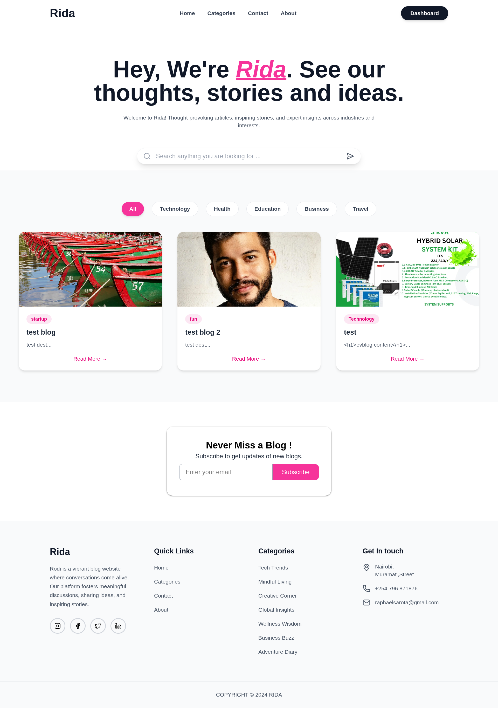
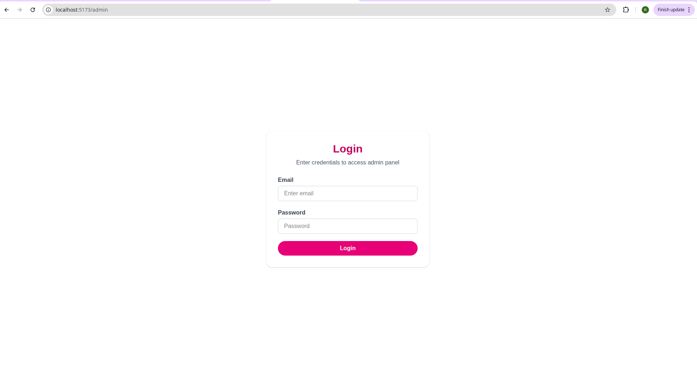
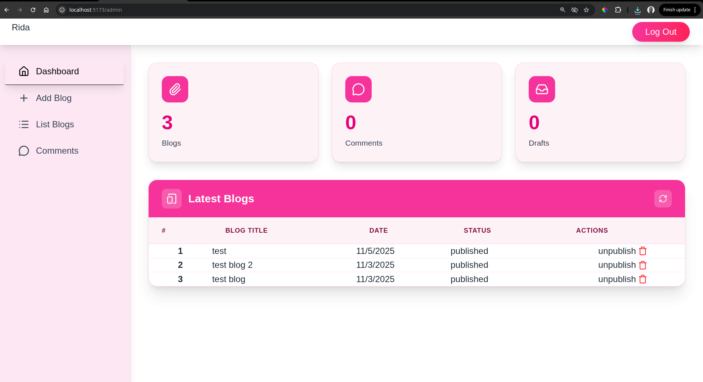
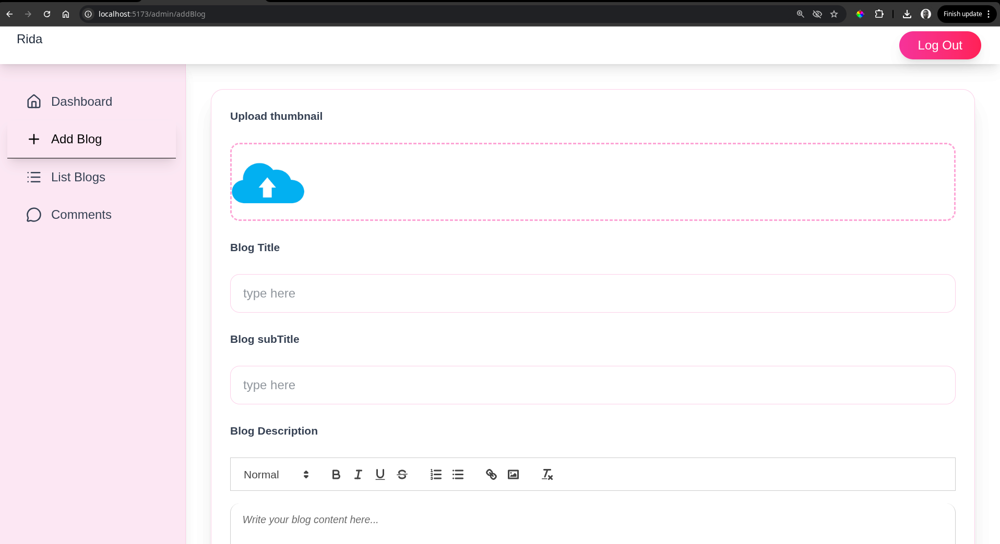
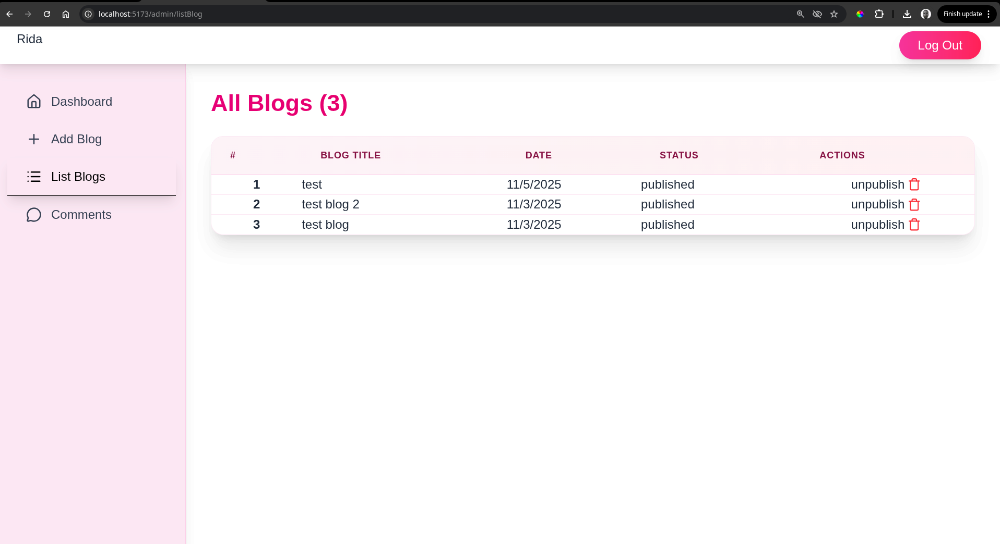
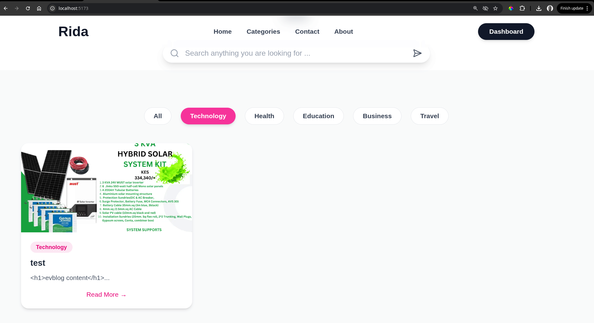
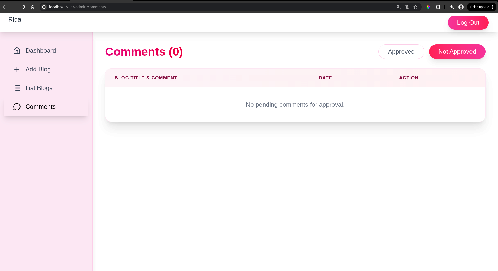
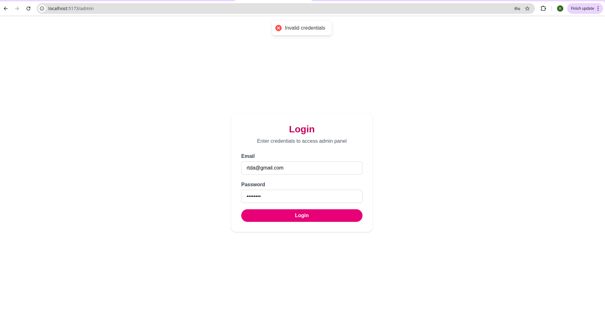
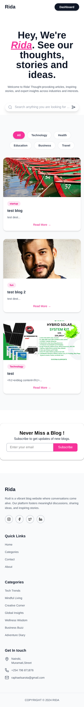

# MERN Stack Blog Platform-WEEK 4 assignment
# Sarota Raphael

A full-stack blogging platform built using the **MERN stack (MongoDB, Express.js, React.js, Node.js)**.  
The project demonstrates seamless front-end and back-end integration, covering CRUD operations, authentication, image uploads, and responsive design.

---

##  Project Structure

```

mern-stack-integration-Topher254/
│
├── client/                 # Frontend (React + Vite + Tailwind CSS)
│   ├── src/
│   │   ├── assets/
│   │   ├── components/
│   │   ├── context/
│   │   ├── pages/
│   │   │   ├── admin/
│   │   │   ├── Home.jsx
│   │   │   └── Blog.jsx
│   │   ├── App.jsx
│   │   ├── main.jsx
│   │   └── index.css
│   ├── package.json
│   └── vite.config.js
│
├── server/                 # Backend (Node.js + Express + MongoDB)
│   ├── config/
│   │   ├── db.js
│   │   └── imageKit.js
│   ├── controllers/
│   │   ├── adminController.js
│   │   └── blogController.js
│   ├── middleware/
│   │   ├── auth.js
│   │   └── multer.js
│   ├── models/
│   │   ├── blog.js
│   │   ├── comment.js
│   │   └── userSchema.js
│   ├── routes/
│   │   ├── adminRoute.js
│   │   └── blogRoutes.js
│   ├── server.js
│   ├── package.json
│
├── screenshots/            # App preview images
│   ├── landing.png
│   ├── login.png
│   ├── dashboard.png
│   ├── addblog.png
│   ├── listblogs.png
│   ├── blogfilter.png
│   ├── comments.png
│   ├── authmiddleware.png
│   └── responsiveness.png
│
├── README.md
└── Week4-Assignment.md

````

---

##  Features

###  Front-End
- Responsive UI built with React and Tailwind CSS  
- Blog listing with category-based filtering and search  
- Blog details view with comments  
- Admin dashboard for managing blogs and comments  
- Add, edit, and delete blogs  
- Responsive and clean interface for all screen sizes  

###  Back-End
- RESTful API using Express.js  
- MongoDB integration with Mongoose  
- JWT-based authentication and route protection  
- Multer for image upload handling  
- ImageKit integration for optimized image hosting  
- Comment management and approval system  

---

##  API Endpoints Overview

### Public Routes
| Method | Endpoint | Description |
|--------|-----------|-------------|
| GET | `/api/blog/all` | Fetch all blogs |
| GET | `/api/blog/:blogId` | Get blog by ID |
| POST | `/api/blog/add-comment` | Add comment to a blog |
| GET | `/api/blog/comments` | Retrieve all comments |

### Admin Routes (Protected)
| Method | Endpoint | Description |
|--------|-----------|-------------|
| POST | `/api/admin/login` | Admin login |
| GET | `/api/admin/blogs` | Retrieve all blogs (admin view) |
| POST | `/api/blog/add` | Add new blog with image upload |
| POST | `/api/blog/delete` | Delete blog |
| POST | `/api/blog/toggle-publish` | Publish/unpublish blog |
| GET | `/api/admin/dashboard` | Dashboard stats |
| POST | `/api/admin/approve-comment` | Approve comment |
| POST | `/api/admin/delete-comment` | Delete comment |

---

##  Authentication
- Users can **view and comment** on blogs without login.  
- Admins can **add, delete, and publish/unpublish** blogs.  
- Protected routes are handled with JWT tokens (`auth.js` middleware).  

---

## Screenshots

| **Landing Page** | **Login Page** | **Admin Dashboard** |
|:-----------------:|:---------------:|:--------------------:|
|  |  |  |

| **Add Blog Page** | **Blog List View** | **Blog Filtering** |
|:------------------:|:------------------:|:-------------------:|
|  |  |  |

| **Comments Management** | **Auth Middleware in Action** | **Mobile Responsiveness** |
|:------------------------:|:-----------------------------:|:---------------------------:|
|  |  |  |

---

## ⚡ Installation & Setup

### 1️⃣ Clone the Repository
```bash
git clone https://github.com/<your-username>/mern-stack-integration-Topher254.git
cd mern-stack-integration-Topher254
````

###  Setup the Backend

```bash
cd server
npm install
```

Create a `.env` file inside `server/`:

```env
MONGO_URI=your_mongodb_connection_string
JWT_SECRET=your_secret_key
IMAGEKIT_PUBLIC_KEY=your_imagekit_public_key
IMAGEKIT_PRIVATE_KEY=your_imagekit_private_key
IMAGEKIT_URL_ENDPOINT=your_imagekit_url_endpoint
PORT=5001
```

Start the backend:

```bash
npm run dev
```

Server runs at → `http://localhost:5001`

---

### 3️⃣ Setup the Frontend

```bash
cd ../client
npm install
npm run dev
```

Frontend runs at → `http://localhost:5173`

---

##  Tech Stack

| Category             | Technologies              |
| -------------------- | ------------------------- |
| **Frontend**         | React, Vite, Tailwind CSS |
| **Backend**          | Node.js, Express.js       |
| **Database**         | MongoDB with Mongoose     |
| **Authentication**   | JWT (JSON Web Token)      |
| **File Uploads**     | Multer + ImageKit         |
| **State Management** | React Context API         |

---

##  Expected Outcome

* Fully functional **MERN stack blog system**
* Proper integration between all stack layers
* Responsive and user-friendly UI
* Authentication and authorization for admin control
* CRUD operations for blogs and comments

---


## 👨 Author

**Sarota Ondieki Raphael**

